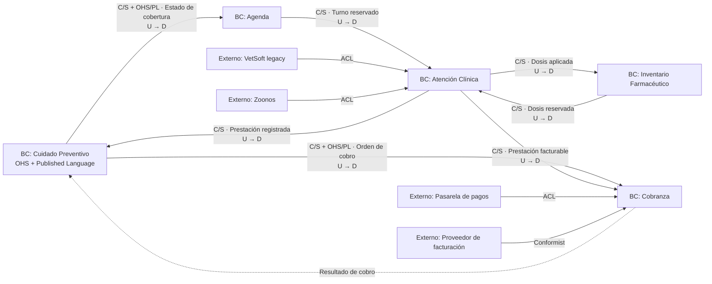

# Ejercicio de DDD — Huella

Resolución propia, acompañada y en progreso. No es una solución oficial de la cátedra.

## Fuente y alcance

- Consigna oficial: `P02`, *Ejercicio de DDD: Huella*.
- El trabajo pedido es un diseño de dominio, no un esquema de base de datos, un diagrama de despliegue ni una implementación. [P02, p. 1]
- La resolución debe conservar los conflictos de lenguaje y acotarlos por contexto, no reemplazarlos por un glosario global. [P02, p. 1] [P02, p. 6]
- Estado actual: comprensión de la consigna y E1–E6 resueltos; E7 pendiente.

## Comprensión inicial del negocio

El diferencial competitivo de Huella no es la consulta veterinaria ni el mero cobro de una cuota. Es el **Plan Huella y su seguimiento preventivo activo**: determinar qué cuidados corresponden a cada animal, controlar su calendario y contactar al responsable cuando algo se atrasa. Martín lo identifica como el negocio real y le atribuye el 70 % de la facturación recurrente. [P02, p. 1]

Distinciones de trabajo:

- **Turno:** reserva de un horario con un profesional para atender a un animal.
- **Consulta:** encuentro clínico que agrega información a la historia del animal.
- **Práctica:** prestación concreta realizada o prevista —por ejemplo una vacuna, un control, una castración o un estudio— que Administración puede codificar, tarifar y cubrir. [P02, p. 2] [P02, p. 3] [P02, p. 4]

## E1 — Ubiquitous Language conflictivo

El lenguaje ubicuo es local al bounded context. Que una palabra tenga varios significados es una señal para acotar modelos y traducirlos en sus bordes, no para imponer una definición global. [T03, p. 14] [T03, p. 16] [T03, p. 17]

| Término | Recepción | Clínica | Depósito | Administración |
|---|---|---|---|---|
| **Alta** | Registro de una persona y luego de su mascota. | Egreso de un animal internado cuando puede retirarse. | No es un término central de su lenguaje. | Activación de una afiliación y comienzo de su cobertura. |
| **Vacuna** | Práctica o motivo para el cual se reserva un turno y se consulta cobertura. | Acto médico aplicado a un paciente, registrado con fecha, dosis y próxima aplicación. | Dosis física perteneciente a un lote, con vencimiento, existencias y ubicación. | Práctica del nomenclador con código, precio, cobertura y copago. |
| **Paciente / cliente / titular** | Persona registrada que contacta a la clínica y animal asociado al turno; el sistema actual mezcla y duplica sus fichas. | El paciente es el animal; la persona es su responsable clínico y legal. | El animal importa como referencia de trazabilidad para productos regulados. | El cliente es el titular que paga; el animal es un ítem del comprobante. |
| **Práctica** | Prestación prevista cuya cobertura debe conocerse antes de la atención. | Acto clínico realizado sobre el animal. | Puede originar el consumo de una dosis o producto, aunque no es la identidad usada para administrar el stock. | Código del nomenclador con precio, reglas de cobertura y copago. |
| **Dueño / responsable / pagador** | Persona que contacta o acompaña al animal. | Persona que informa, autoriza y firma consentimientos. | Referencia secundaria; la trazabilidad principal exige animal, lote y profesional. | Titular del plan o persona que paga una cuota o prestación. No necesariamente coinciden. |

### Consecuencias descubiertas

Una sola persona puede cumplir varios roles, pero el modelo no debe asumir que acompañante, responsable clínico/legal, titular del plan y pagador son siempre la misma persona. El mensaje sobre la caniche muestra precisamente esa ambigüedad. [P02, p. 5]

La identidad y la historia clínica deben seguir al animal aunque cambien su responsable, propietario, contacto, titular del plan, sucursal o profesional. Las correcciones de historia no se borran: deben conservar qué se corrigió y quién lo hizo. [P02, p. 3] [P02, p. 5]

Conviene distinguir dos aspectos del calendario:

- los actos médicos ya realizados pertenecen a la historia del animal;
- las prestaciones futuras cubiertas dependen además de la afiliación y de su estado.

Por eso, una suspensión puede retirar temporalmente la cobertura sin borrar la necesidad médica ni los antecedentes del animal. [P02, p. 4]

### Hipótesis de traducción para validar en E3 y E6

Clínica y Depósito no deberían compartir un objeto global `Vacuna`:

- Clínica modela el acto médico y debe garantizar que quede registrado en la historia del animal correcto.
- Depósito modela el lote físico y debe garantizar disponibilidad, salida por vencimiento más próximo y prohibición de usar lotes vencidos. [P02, p. 3] [P02, p. 4]

Como hipótesis inicial, un hecho expresado por Clínica como `VacunaAplicada` podría traducirse en el borde a `DosisConsumida` en Depósito. Los nombres definitivos y cuáles eventos se publican se decidirán en E6.

## E2 — Subdominios y clasificación

Un subdominio es una partición del problema de negocio; todavía no es un bounded context ni un microservicio. El Core merece la mayor inversión porque diferencia competitivamente, un Supporting es necesario y específico pero no diferenciador, y un Generic corresponde a una capacidad razonablemente resuelta por el mercado. [T03, p. 19] [T03, p. 20] [T03, p. 22]

| Subdominio o capacidad | Clasificación actual | Justificación |
|---|---|---|
| Gestión del Plan y seguimiento preventivo | **Core** | Es el diferencial declarado: niveles, afiliación, cobertura, carencia, calendario y búsqueda activa ante atrasos sostienen la propuesta de valor y gran parte de la recurrencia. [P02, p. 1] [P02, p. 2] [P02, p. 4] |
| Atención clínica e historia médica | **Supporting** | Es imprescindible y contiene reglas propias —continuidad entre responsables y sucursales, internación y correcciones auditables—, pero las consultas veterinarias no son el diferencial declarado. [P02, p. 1] [P02, p. 3] [P02, p. 5] |
| Agenda y turnos | **Generic** | La reserva de horarios es un problema común con alternativas de mercado. Las reglas particulares de sobreturnos y la consulta de cobertura requieren adaptación o integración, pero no convierten por sí solas a la agenda en el Core. [P02, p. 2] |
| Inventario, lotes y trazabilidad | **Supporting** | Aunque existen soluciones de inventario, Huella expresa reglas veterinarias y regulatorias relevantes: FEFO, lotes completos vencidos, heladeras por sucursal, mínimos y trazabilidad de psicotrópicos/anestésicos por lote, animal y profesional. La cátedra también usa el inventario interno como ejemplo de Supporting. [P02, p. 3] [P02, p. 4] [T03, p. 20] |
| Procesamiento de pagos con tarjeta | **Generic** | La pasarela ya resuelve el mecanismo. Su vocabulario externo no debe contaminar el lenguaje del Plan o de Administración. [P02, p. 5] |
| Facturación electrónica | **Generic** | Ya se delega a un proveedor y Martín declara expresamente que no quiere volver a desarrollarla. [P02, p. 2] [P02, p. 4] |
| Envío técnico de recordatorios por WhatsApp | **Generic** | La API de mensajería es reemplazable y está resuelta por terceros. Decidir a quién recordar, por qué práctica y cuándo está atrasada sí pertenece al Core. [P02, p. 1] [P02, p. 5] |
| Autenticación de usuarios | **Generic** | Se desea utilizar un proveedor de identidad y no reconstruir capacidades estándar como recuperación de contraseñas. [P02, p. 5] |

### Decisión sobre Inventario

Inventario queda clasificado como Supporting. Que exista software comprable no elimina las reglas veterinarias y regulatorias específicas del dominio. La decisión posterior de comprar una solución con adaptación o implementar una capacidad propia no cambia por sí sola la clasificación del subdominio.

## E3 — Bounded Contexts

Se mantienen cinco contextos. Las responsabilidades se formulan como capacidades y reglas del negocio, no como servicios CRUD ni como unidades de despliegue. [T03, p. 21] [T03, p. 22] [T03, p. 31]

| Bounded Context | Responsabilidad | Lenguaje propio | No hace |
|---|---|---|---|
| **Cuidado Preventivo** | Gestionar la afiliación del animal al Plan Huella, sus niveles y coberturas; construir el calendario preventivo, detectar atrasos y decidir a quién contactar. | Titular, Nivel del Plan, Calendario Preventivo. | No realiza atención médica, reserva horarios, mueve stock ni procesa pagos. |
| **Atención Clínica** | Registrar consultas, diagnósticos, tratamientos, internaciones y altas, preservando la historia clínica auditable del animal. | Paciente, Consulta, Historia Clínica. | No decide coberturas, reserva turnos, administra existencias ni cobra prestaciones. |
| **Agenda** | Asignar turnos y sobreturnos según la disponibilidad de profesionales y las reglas de cada franja horaria. | Turno, Sobreturno, Franja Horaria. | No diagnostica ni trata, decide coberturas, mantiene la historia clínica, mueve stock o procesa cobros. |
| **Inventario Farmacéutico** | Controlar lotes, dosis, vencimientos, ubicaciones y reposición; garantizar el orden de salida y la trazabilidad de productos regulados. | Lote, Dosis, Heladera. | No registra el acto médico, determina coberturas, asigna turnos ni cobra prestaciones. |
| **Cobranza** | Gestionar el cobro de cuotas mensuales y copagos mediante proveedores externos, registrar sus resultados y solicitar la facturación correspondiente. | Cuota Mensual, Copago, Cobro Rechazado. | No define niveles, afiliaciones o coberturas; tampoco atiende pacientes, agenda turnos ni administra stock. |

### Frontera Cuidado Preventivo–Cobranza

La afiliación y sus reglas —nivel, carencia, antigüedad, cobertura y estado— pertenecen a Cuidado Preventivo porque definen el producto diferencial. Cobranza no define la suscripción: ejecuta o coordina el cobro. Si un pago falla, informa el resultado y Cuidado Preventivo decide la suspensión o reactivación según las reglas del Plan. [P02, p. 2] [P02, p. 4]

Esta separación evita que el modelo del Core adopte el vocabulario técnico de la pasarela (`merchant`, `settlement`, `chargeback`). [P02, p. 5]

### Lenguaje local de Cuidado Preventivo

- **Titular:** persona vinculada contractualmente a la afiliación. No se presume que sea siempre quien acompaña al animal, su responsable clínico ni quien paga una prestación puntual.
- **Nivel del Plan:** modalidad Básico, Full o Senior que determina prestaciones cubiertas, frecuencias y copagos. [P02, p. 2]
- **Calendario Preventivo:** conjunto de cuidados previstos para un animal afiliado, con sus fechas esperadas y estado de seguimiento.

El “No hace” explicita la frontera del contexto. No introduce otra categoría: enumera responsabilidades cercanas que podrían confundirse con las propias y que deberán resolverse en otros contextos o integraciones.

### Lectura del lenguaje de los demás contextos

- En **Atención Clínica**, `Paciente` es el animal; una `Consulta` incorpora observaciones y decisiones médicas a su `Historia Clínica`. Esta última persiste aunque cambien el responsable o la sucursal. [P02, p. 3]
- En **Agenda**, un `Turno` reserva un bloque con un profesional, un `Sobreturno` altera la capacidad prevista y la `Franja Horaria` limita cuántos sobreturnos se admiten. [P02, p. 2]
- En **Inventario Farmacéutico**, el `Lote` da identidad y vencimiento al stock, la `Dosis` es la unidad consumible y la `Heladera` expresa su ubicación física por sucursal. [P02, p. 3] [P02, p. 4]
- En **Cobranza**, la `Cuota Mensual` sostiene la afiliación, el `Copago` corresponde a una atención cubierta y un `Cobro Rechazado` es un resultado que Cuidado Preventivo debe conocer para aplicar sus propias reglas. [P02, p. 4]

### Comprobación de E3

La propuesta cumple los requisitos de la consigna: contiene cinco bounded contexts, nombres del negocio, una responsabilidad, tres términos locales y exclusiones explícitas para cada uno. [P02, p. 6]

## E4 — Context Map

El mapa de contextos representa dependencias entre modelos: quién define una capacidad o contrato (**upstream**) y quién depende de ella (**downstream**). No es un diagrama de red ni obliga a usar HTTP, eventos o microservicios; esas son decisiones posteriores sobre cómo implementar la integración. [T03, p. 24] [T03, p. 29] [T03, p. 31]



En las flechas sólidas, `U → D` señala upstream hacia downstream. La flecha punteada de resultado no invierte por sí sola la relación estratégica entre Cuidado Preventivo y Cobranza: Cuidado Preventivo define qué se debe cobrar y las reglas de la afiliación; Cobranza devuelve el resultado de ejecutar esa orden.

### Relaciones internas

| Upstream / Supplier | Downstream / Customer | Relación y contrato | Justificación |
|---|---|---|---|
| Atención Clínica | Cuidado Preventivo | Customer/Supplier; publica una prestación clínica registrada. | Cuidado Preventivo depende del hecho médico para actualizar el calendario, pero traduce la práctica clínica a un cumplimiento preventivo. |
| Cuidado Preventivo | Agenda | Customer/Supplier mediante OHS + Published Language; consulta `EstadoDeCobertura`. | Recepción necesita informar la cobertura antes de la consulta, pero Agenda no debe calcular niveles, carencia o copagos. [P02, p. 2] |
| Cuidado Preventivo | Cobranza | Customer/Supplier mediante OHS + Published Language; emite una orden de cobro con concepto e importe. | El Core define cuota o copago; Cobranza ejecuta el pago. El resultado vuelve mediante un contrato público y el Core decide suspensión o reactivación. [P02, p. 4] |
| Agenda | Atención Clínica | Customer/Supplier; publica el turno reservado o sobreturno admitido. | Clínica necesita saber qué animal y profesional se atenderán, sin adoptar las reglas internas de franjas y disponibilidad. |
| Inventario Farmacéutico | Atención Clínica | Customer/Supplier; confirma una dosis reservada o informa que no está disponible. | Clínica necesita una dosis válida antes de registrar la aplicación, sin incorporar lotes, vencimientos o FEFO en su modelo. |
| Atención Clínica | Inventario Farmacéutico | Customer/Supplier; publica una dosis aplicada con referencias públicas de producto y lote. | Inventario descuenta el lote el mismo día, pero traduce el acto médico a un movimiento de existencias. [P02, p. 3] |
| Atención Clínica | Cobranza | Customer/Supplier; publica una prestación facturable. | Cobranza necesita conocer qué se realizó, pero no incorpora diagnóstico, tratamiento ni historia clínica. |

`Customer/Supplier` expresa una dependencia negociada: el supplier ofrece una capacidad y el customer influye en sus prioridades e interfaz. No significa que ambos compartan objetos internos. [T03, p. 25]

### Open Host Service + Published Language

**Cuidado Preventivo** funciona como Open Host Service porque Agenda, Cobranza y futuros consumidores —por ejemplo la aplicación del dueño o la guardia externa— necesitan consultar capacidades estables del Plan. El OHS es el punto de acceso; el Published Language es el contrato explícito, no el aggregate interno. [T03, p. 27] [P02, p. 5]

El lenguaje publicado podría incluir:

- consulta `ObtenerEstadoCobertura(animalId, practica, fecha)`;
- respuesta `EstadoDeCobertura` con `cubierta`, `copago`, `motivo` y vigencia;
- evento `CuotaMensualGenerada` con una referencia pública, importe y vencimiento;
- eventos `CoberturaAutorizada`, `CoberturaRechazada` y `AfiliacionSuspendida` solo para los consumidores que realmente necesiten reaccionar.

Los nombres son contratos de integración provisionales y se revisarán al definir los eventos de E6. No se publica todo cambio interno del Core.

### Anticorruption Layers

Una ACL traduce el modelo de otro contexto o proveedor al lenguaje propio y evita que el modelo ajeno se propague. [T03, p. 26]

- **VetSoft → Atención Clínica:** traduce la tabla `CLIENTES`, los registros duplicados y `CAMPO_LIBRE_1…7` a paciente, responsable e historia clínica, conservando trazabilidad del dato migrado. [P02, p. 4]
- **Zoonos → Atención Clínica:** traduce su concepto fijo de paciente y su formato de atención a una incorporación auditable en la historia clínica. Que la API sea “tomar o dejar” no obliga a adoptar su modelo dentro de Clínica. [P02, p. 5]
- **Pasarela → Cobranza:** traduce `merchant`, `settlement` y `chargeback` a intento de cobro, cobro confirmado, cobro rechazado o reversión. [P02, p. 5]

### Conformist elegido

**Cobranza** es downstream Conformist del proveedor de facturación electrónica: adopta su contrato fijo para solicitar comprobantes y consultar aceptaciones o rechazos. La decisión es razonable porque Huella no controla ese modelo, la facturación electrónica es genérica y el dueño decidió no desarrollarla. El acoplamiento se mantiene fuera del Core. [T03, p. 25] [P02, p. 2] [P02, p. 4]

No se elige Conformist frente a VetSoft, Zoonos o la pasarela porque sus modelos sí contaminarían términos centrales de Clínica o Cobranza; allí se prefieren ACL.

### Shared Kernel evitado

Existe la tentación de compartir un modelo común de `Animal/Paciente`, `Titular/Cliente`, `Práctica/Vacuna` o incluso una base de datos entre Cuidado Preventivo, Atención Clínica, Agenda, Inventario y Cobranza. Se evita el Shared Kernel porque cada contexto aplica identidades, datos e invariantes diferentes y un cambio exigiría coordinación global. [T03, p. 28] [T03, p. 33] [P02, p. 10]

Los contextos pueden intercambiar identificadores opacos —por ejemplo `animalId`, `loteRef` o `practicaRef`— y contratos versionados sin compartir entidades, aggregates, tablas ni clases de dominio.

### Comprobación de E4

- ACL: VetSoft/Clínica, Zoonos/Clínica y Pasarela/Cobranza.
- OHS + Published Language: Cuidado Preventivo hacia varios consumidores.
- Customer/Supplier: varias relaciones con upstream y downstream explícitos.
- Conformist: Cobranza frente al proveedor de facturación electrónica.
- Shared Kernel evitado: modelos conflictivos de animal, persona, práctica y vacuna.

Con esto se cumplen todos los elementos obligatorios de E4. [P02, p. 6]

## E5 — Modelo táctico dentro del Core

Se modela el bounded context **Cuidado Preventivo**. Una entidad conserva identidad aunque cambien sus atributos; un value object se define por sus valores y normalmente se reemplaza de forma completa; un aggregate agrupa entidades y value objects bajo una raíz que protege una frontera de consistencia transaccional. [T03, p. 35] [T03, p. 36] [T03, p. 37]

### Supuesto de modelado

Se adopta **una afiliación por animal**, vinculada a un titular vigente. La decisión se basa en que el nivel, la edad, las frecuencias cubiertas y el calendario se evalúan para un animal concreto. La consigna no confirma si un contrato puede agrupar varias mascotas ni qué ocurre al cambiar de titular; se conserva como hotspot para validar con negocio. [P02, p. 1] [P02, p. 2] [P02, p. 5]

### Aggregate

```text
AfiliacionPreventiva                         ← Aggregate Root
├── afiliacionId                            ← identidad propia
├── animalId                                ← referencia opaca, no entidad compartida
├── titularId                               ← referencia opaca, no entidad compartida
├── nivel: NivelDelPlan                     ← Value Object
├── vigencia: PeriodoDeCobertura            ← Value Object
├── estado                                  ← activa | suspendida | baja
├── version                                 ← control de concurrencia
└── prestacionesProgramadas[]
    └── PrestacionPreventivaProgramada      ← Entity
        ├── prestacionProgramadaId
        ├── practicaRef
        ├── fechaObjetivo
        └── estado                          ← pendiente | cubierta | cumplida | vencida
```

**Aggregate Root: `AfiliacionPreventiva`.** Tiene identidad y ciclo de vida propios. Es el único punto por el que se activan o suspenden coberturas, se cambia de nivel y se modifica el calendario. El exterior no cambia directamente una prestación programada. [T03, p. 37]

**Entidad interna: `PrestacionPreventivaProgramada`.** Cada ocurrencia del calendario tiene identidad porque debe seguir siendo la misma aunque cambie su fecha o pase de pendiente a cubierta, cumplida o vencida. Dos aplicaciones futuras de la misma clase de vacuna no son la misma prestación programada.

`Animal` y `Titular` no se incorporan como entidades del aggregate. Cuidado Preventivo conserva referencias opacas a ellos; sus modelos completos pertenecen a otros límites y compartirlos recrearía el modelo global que E1 y E4 decidieron evitar.

### Value Objects

1. **`NivelDelPlan(codigo, version)`.** Representa Básico, Full o Senior y la versión de reglas aplicable. No necesita una identidad independiente: dos valores con el mismo código y versión son intercambiables. Si el nivel cambia se reemplaza el valor completo, conservando el cambio en la vida de la afiliación. [P02, p. 2]
2. **`PeriodoDeCobertura(fechaAlta, finCarencia, fechaFin?)`.** Se define enteramente por sus fechas, valida que estén ordenadas y no tiene un ciclo de vida independiente. Dos períodos con los mismos límites significan lo mismo. Permite evaluar la carencia de 30 días sin repartir esa regla entre varios objetos. [P02, p. 4]

### Invariante fuerte

> Una prestación programada solo puede quedar marcada como **cubierta** si la afiliación está activa, terminó el período de carencia, el Nivel del Plan incluye esa práctica y todavía no se agotó su frecuencia cubierta para el período.

`AfiliacionPreventiva` comprueba todos esos datos y registra la cobertura dentro de una única modificación transaccional. Si alguna condición falla, rechaza la intención y no cambia el calendario. Esto evita que dos autorizaciones concurrentes excedan el límite anual.

**Inferencia de diseño:** para dos modificaciones simultáneas se usaría una versión del aggregate y control de concurrencia optimista. Solo una escritura sobre la versión observada puede confirmar; la otra debe releer y reevaluar la invariante. La consigna no prescribe una tecnología de persistencia.

La elegibilidad de Senior queda como regla pendiente de precisión: el relato menciona animales de más de ocho años y también una antigüedad necesaria, pero no define su duración ni cómo combinar ambas condiciones. [P02, p. 2] [P02, p. 4]

### Fuera del aggregate y consistencia eventual

La **realización del acto médico y su registro en la Historia Clínica** quedan en Atención Clínica. Cuando Clínica publique una prestación registrada, Cuidado Preventivo podrá marcar eventualmente la `PrestacionPreventivaProgramada` correspondiente como cumplida y calcular la próxima fecha.

No se intenta modificar Historia Clínica y `AfiliacionPreventiva` en una única transacción: pertenecen a contextos y modelos distintos, la integración puede sufrir latencia o reintentos y debe resolverse mediante un contrato idempotente. El mismo hecho podrá provocar además el descuento del lote en Inventario, sin meter lotes ni dosis físicas dentro de este aggregate. [P02, p. 3] [T03, p. 32]

### Comprobación de E5

- Aggregate Root: `AfiliacionPreventiva`.
- Entidad contenida: `PrestacionPreventivaProgramada`.
- Value Objects justificados: `NivelDelPlan` y `PeriodoDeCobertura`.
- Invariante: solo autorizar cobertura válida, activa, fuera de carencia y dentro de frecuencia.
- Consistencia eventual: el cumplimiento clínico actualiza después el calendario preventivo.

Con esto se cumplen todos los elementos obligatorios de E5. [P02, p. 7]

## E6 — Commands y Domain Events por contexto

Un command expresa una intención en imperativo, entra a un aggregate y puede ser rechazado. Un domain event expresa un hecho ya ocurrido en pasado y se propaga después de que el aggregate confirmó su cambio. [T03, p. 38]

La marca `⭐` identifica eventos de integración que cruzan el borde y forman parte de un Published Language. Los eventos sin marca son internos. Un fracaso listado aquí es un hecho de negocio relevante —por ejemplo, una cobertura o un sobreturno rechazados—, no cada error técnico o validación de formulario. [P02, p. 7]

### Cuidado Preventivo

**Aggregate Root:** `AfiliacionPreventiva`.

| Command | Aggregate que lo recibe |
|---|---|
| `AfiliarAnimal` | `AfiliacionPreventiva` |
| `AutorizarCobertura` | `AfiliacionPreventiva` |
| `RegistrarCumplimientoPreventivo` | `AfiliacionPreventiva` |
| `GenerarCuotaMensual` | `AfiliacionPreventiva` |
| `SuspenderAfiliacion` / `ReactivarAfiliacion` | `AfiliacionPreventiva` |

| Domain Event | Alcance y uso |
|---|---|
| `⭐ AfiliacionActivada` | Integración: Agenda y Cobranza pueden actualizar sus vistas. |
| `CalendarioPreventivoGenerado` | Interno: construye las prestaciones programadas de la afiliación. |
| `⭐ CoberturaAutorizada` | Integración: informa práctica, vigencia y copago sin exponer el aggregate. |
| `⭐ CoberturaRechazada` | Integración y **fracaso**: informa un motivo de negocio como carencia, suspensión o frecuencia agotada. |
| `⭐ CuotaMensualGenerada` | Integración: Cobranza crea la obligación correspondiente. |
| `PracticaPreventivaCumplida` | Interno: actualiza el calendario y calcula la próxima fecha. |
| `⭐ AfiliacionSuspendida` | Integración y **fracaso**: Agenda y Cobranza dejan de considerar vigente la cobertura. |
| `⭐ AfiliacionReactivada` | Integración: vuelve a habilitar cobertura conservando la antigüedad cuando corresponde. |

Consume `⭐ PrestacionRegistrada` de Atención Clínica y `⭐ CobroConfirmado` / `⭐ CobroRechazado` de Cobranza. Policies del contexto traducen esos eventos en `RegistrarCumplimientoPreventivo`, `SuspenderAfiliacion` o `ReactivarAfiliacion`; un evento externo no modifica directamente el aggregate.

### Atención Clínica

**Aggregate Root:** `HistoriaClinica`.

| Command | Aggregate que lo recibe |
|---|---|
| `AbrirConsulta` | `HistoriaClinica` |
| `RegistrarVacunacion` | `HistoriaClinica` |
| `CorregirHistoriaClinica` | `HistoriaClinica` |
| `IncorporarAtencionExterna` | `HistoriaClinica` |

| Domain Event | Alcance y uso |
|---|---|
| `ConsultaAbierta` | Interno: inicia una atención sobre el paciente identificado. |
| `VacunaAplicada` | Interno: acto médico con paciente, profesional, dosis y fecha. |
| `HistoriaClinicaCorregida` | Interno: conserva la corrección, autor y motivo sin borrar el registro previo. |
| `⭐ PrestacionRegistrada` | Integración: comunica a Cuidado Preventivo y Cobranza una prestación mínima, sin diagnóstico ni tratamiento. |
| `⭐ DosisAplicada` | Integración: comunica a Inventario la referencia de lote consumida. |
| `VacunacionRechazada` | Interno y **fracaso**: no se registra si el paciente no está identificado inequívocamente o no existe una reserva de dosis válida. |

Consume `⭐ TurnoReservado` / `⭐ SobreturnoAgregado` de Agenda y `⭐ DosisReservada` / `⭐ DosisNoDisponible` de Inventario. La ACL de Zoonos traduce su reporte al command `IncorporarAtencionExterna`; Zoonos no introduce directamente eventos con su vocabulario en `HistoriaClinica`.

### Agenda

**Aggregate Root:** `AgendaProfesional`, acotada por profesional y jornada o franja para poder aplicar el límite de sobreturnos de manera consistente.

| Command | Aggregate que lo recibe |
|---|---|
| `ReservarTurno` | `AgendaProfesional` |
| `AgregarSobreturno` | `AgendaProfesional` |
| `CancelarTurno` | `AgendaProfesional` |
| `RegistrarInasistencia` | `AgendaProfesional` |

| Domain Event | Alcance y uso |
|---|---|
| `⭐ TurnoReservado` | Integración: Atención Clínica conoce animal, profesional y horario mediante referencias públicas. |
| `⭐ SobreturnoAgregado` | Integración: Atención Clínica conoce la alteración de la agenda. |
| `⭐ TurnoCancelado` | Integración: libera la atención prevista. |
| `InasistenciaRegistrada` | Interno: permite analizar huecos y reglas futuras de agenda. |
| `SobreturnoRechazado` | Interno y **fracaso**: la franja ya alcanzó el máximo admitido. |

Consume `⭐ CoberturaAutorizada`, `⭐ CoberturaRechazada` y `⭐ AfiliacionSuspendida` de Cuidado Preventivo para mantener una vista informativa en recepción. Esos eventos no le permiten recalcular cobertura ni modificar la afiliación.

### Inventario Farmacéutico

**Aggregate Root:** `StockFarmaceutico`, acotado por producto y sucursal y con los lotes disponibles, para seleccionar por vencimiento y proteger las existencias.

| Command | Aggregate que lo recibe |
|---|---|
| `ReservarDosis` | `StockFarmaceutico` |
| `ConsumirDosis` | `StockFarmaceutico` |
| `DescartarLoteVencido` | `StockFarmaceutico` |
| `RegistrarReposicion` | `StockFarmaceutico` |

| Domain Event | Alcance y uso |
|---|---|
| `⭐ DosisReservada` | Integración: Atención Clínica recibe una referencia de lote válido. |
| `DosisConsumida` | Interno: descuenta existencias y actualiza la trazabilidad del lote. |
| `⭐ DosisNoDisponible` | Integración y **fracaso**: no existe una dosis válida para reservar. |
| `⭐ ConsumoRechazadoPorVencimiento` | Integración y **fracaso**: impide aplicar o consumir un lote vencido. |
| `LoteDescartado` | Interno: elimina de disponibilidad todas las dosis remanentes del lote vencido. |
| `⭐ StockMinimoAlcanzado` | Integración: permite iniciar reposición sin publicar cada movimiento interno. |

Consume `⭐ DosisAplicada` de Atención Clínica. Una policy emite `ConsumirDosis` sobre el stock correspondiente; el evento se procesa de forma idempotente para no descontar dos veces ante un reintento.

### Cobranza

**Aggregate Root:** `ObligacionDePago`, que representa una cuota o copago concreto y sus intentos de cobro.

| Command | Aggregate que lo recibe |
|---|---|
| `CobrarCuota` | `ObligacionDePago` |
| `CobrarCopago` | `ObligacionDePago` |
| `RegistrarResultadoDeCobro` | `ObligacionDePago` |
| `SolicitarComprobante` | `ObligacionDePago` |

| Domain Event | Alcance y uso |
|---|---|
| `CobroIniciado` | Interno: registra el intento enviado a la pasarela. |
| `⭐ CobroConfirmado` | Integración: Cuidado Preventivo puede conservar o reactivar la afiliación. |
| `⭐ CobroRechazado` | Integración y **fracaso**: Cuidado Preventivo aplica sus reglas de suspensión. |
| `ComprobanteSolicitado` | Interno: registra el pedido al proveedor de facturación. |
| `ComprobanteEmitido` | Interno: vincula el comprobante aceptado con la obligación. |
| `FacturacionRechazada` | Interno y **fracaso**: deja pendiente la resolución sin fingir que el cobro falló. |

Consume `⭐ CuotaMensualGenerada` y `⭐ CoberturaAutorizada` de Cuidado Preventivo, y `⭐ PrestacionRegistrada` de Atención Clínica. La ACL de la pasarela convierte callbacks externos en `RegistrarResultadoDeCobro`; los términos `settlement` o `chargeback` no entran al aggregate.

### Traducciones principales

Un mismo hecho del mundo real produce nombres distintos según el contexto:

```text
Atención Clínica: VacunaAplicada                 (interno)
        ├── ⭐ PrestacionRegistrada               → Cuidado Preventivo / Cobranza
        └── ⭐ DosisAplicada                      → Inventario Farmacéutico

Cobranza: ⭐ CobroRechazado
        └── policy en Cuidado Preventivo
                └── SuspenderAfiliacion
                        └── ⭐ AfiliacionSuspendida
```

`PrestacionRegistrada` omite datos clínicos sensibles; `DosisAplicada` contiene la referencia necesaria para trazabilidad; ninguno expone el aggregate `HistoriaClinica` completo. Esta separación protege los lenguajes locales y reduce acoplamiento.

### Comprobación de E6

- Los cinco contextos tienen al menos dos commands y tres domain events.
- Cada command entra a un Aggregate Root explícito.
- Todos los commands están en imperativo y los eventos expresan hechos pasados.
- Cada contexto incluye al menos un fracaso de negocio.
- Los eventos públicos están marcados con `⭐`; los demás quedan internos.
- Se identifican eventos consumidos y traducciones entre lenguajes.

Con esto se cumplen todos los requisitos obligatorios de E6. [P02, p. 7]

## Próximos pasos

1. Construir E7 con seis a ocho eventos de E6 en orden temporal para el flujo de vacunación.
2. Incluir tres commands con actor, dos policies, un read model, un sistema externo y dos hotspots.
3. Verificar que cada evento indique qué contexto lo publica y cuál reacciona. [P02, p. 7] [P02, p. 8]
